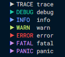

# Logger



## Methods

```go
type LoggerMethods interface {
	Log(level Level, args ...interface{})
	Logf(level Level, format string, args ...interface{})
	Logln(level Level, args ...interface{})

	Trace(args ...interface{})
	Tracef(format string, args ...interface{})
	Traceln(args ...interface{})

	Debug(args ...interface{})
	Debugf(format string, args ...interface{})
	Debugln(args ...interface{})

	Info(args ...interface{})
	Infof(format string, args ...interface{})
	Infoln(args ...interface{})

	Warn(args ...interface{})
	Warnf(format string, args ...interface{})
	Warnln(args ...interface{})

	Error(args ...interface{})
	Errorf(format string, args ...interface{})
	Errorln(args ...interface{})

	Fatal(args ...interface{})
	Fatalf(format string, args ...interface{})
	Fatalln(args ...interface{})

	Panic(args ...interface{})
	Panicf(format string, args ...interface{})
	Panicln(args ...interface{})
}
```